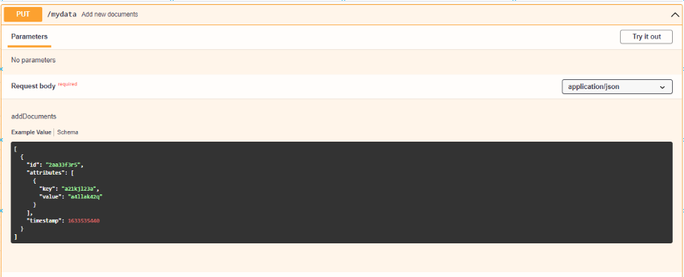
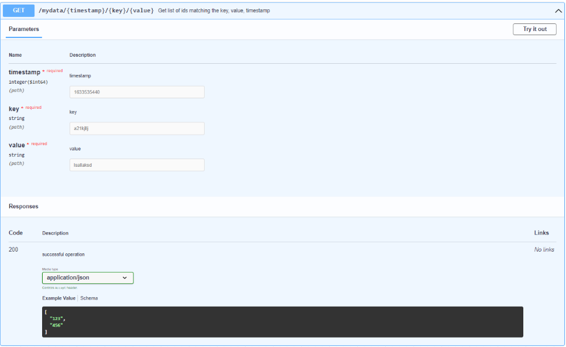
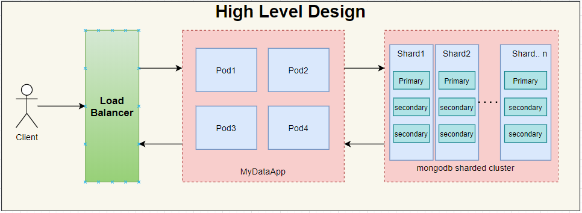

<h1>Problem</h1>

Craft demo details:

We have a requirement to index and query data of the form

 ```json1
{
id : <128bit UTF-8 string>,
attributes: [
{
key : <variable length string not exceeding 256>,
value: <variable length value not exceeding 256>
}],
timestamp : <epoch in microseconds>
}
```

We need to store and retrieve information to support queries like:

- GET /mydata/{timestamp}/{key}/{value} should return a list of ids matching the {key, value,
  timestamp }
    - Assume only one key/val will be supplied always.
    - If the data is not present, return appropriate status code.
    - Limit the length of the returned list to 500

- PUT operation on a document with variable number of attributes for a given id.
    - No updates allowed or update will create a new document

We need a system that can process
- About 10 million docs per second.
- query load of about 100 requests per second.
- Near realtime

Please come up with a low-level design/algorithm to address the above challenge.


<h1>Solution</h1>




